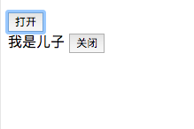

## 一个组件实例（组件是可复用的Vue实例）
```
Vue.component('定义一个组件名,组件名最好是带小横线的写法，尽量不要使用驼峰命名法button-counter', {
    data: function() {
        return {
            count: 0
        }
    },
    template: `
    <button @click="count++">You clicked me {{ count }}times.</button>
    `
})
```
将这个组件<button-counter>作为自定义元素使用
```
html:
<div id="components-demo">
  <button-counter></button-counter>
</div>

JS:
var vm = new Vue({
  el: '#components-demo' 
})
```
除了el这样根实例特有的选项，组件可以接收与new Vue相同的选项，例如：data、computed、watch、methods
## 父子组件通信
父组件通过 prop（down） 给子组件向下传递数据(包括属性和方法)，子组件通过 $emit（up） 触发事件向上给父组件发送消息（传递父组件需要的参数），即 prop 是向下传递，$emit 事件向上传递。
下面是一个儿子向上给爸爸发送消息的例子：

html:
```
<div id="demo">
    <button @click="visible=true">打开</button>
    <child v-show=visible @close="visible=false"></child>
<div>
```

JS:
```
var vm = new Vue({  //首先创建一个vue的实例
  el: '#demo',
  data: {
    visible: false  //默认是看不见儿子的
  }
})

Vue.component('child',{  //创建一个名为child的组件
  template:`
  <div>我是儿子
    <button @click="$emit('close')">关闭</button>  //$emit触发事件向上发送消息
  </div>
  `
})
```

## 非父子组件通信（使用一个new Vue作为中央事件总线）
1. 在两个组件都能访问到的作用域创建var bus = new Vue()
2. 触发组件A中的事件bus.$emit('xxx')
3. 在组件B创建的钩子中监听事件bus.$on('xxx',xxx-data => { //处理 })
实例：假设有三个组件main.vue、click.vue和show.vue，click和show是main组件下的兄弟组件，click通过v-for在父组件中遍历在多个列表项里，需要实现在click组件中触发点击事件，在show组件中将被点击的dom元素展示出来
```
<!-- 首先给click组件添加点击事件 -->
<div class="click" @click="doClick($event)"></div>

<!-- 想要在doClick()方法中实现与show组件的通信，需要新建一个js文件来创建我们需要的eventBus，那么就先命名为bus.js -->
var bus = new Vue()

<!-- 然后需要在doClick方法中来触发一个事件，这样我们每次在click组件中点击，就会在bus中触发这个名为getTarget的事件，并且将event.target顺着事件传递出去 -->
methods: {
  addCart(event) {
    bus.$emit('getTarget', event.target);
  }
}

<!-- 接着在show组件的created()钩子中调用bus来监听这个事件 -->
created() {
  bus.$on('getTarget', target => {
    console.log(target);
  })
}
<!-- 这样每次在click组件中触发点击事件，就会把event.target传到show组件中并log出来 -->
```
## Vue的11个生命周期钩子
beforeCreate、created、beforeMount、mounted、beforeUpdate、updated、activated、deactivated、beforeDestroy、destroyed、errorCaptured
## Vuex的作用
官方定义：专门为Vue.js应用程序开发的状态管理模式。它采用集中式存储管理应用的所有组件的状态，并以相应的规则保证状态以一种可预测的方式发生变化。

使用Vuex解决了一下两个问题
- 组件之间的数据通信
- 使用单向数据流的方式进行数据的中心化管理（所谓的单向数据流，就是当用户进行操作的时候，会从组件发出一个 action，这个 action 流到 store 里面，触发 store 对状态进行改动，然后 store 又触发组件基于新的状态重新渲染）对于复杂的应用来说，Vuex实施统一管理，方便维护和跟踪

我们不好说为什么使用Vuex，但是如果在下面这种情况下不使用Vuex，将会带来很多弊端：

假设在一个app里有四个tab，每个tab都需要获取用户的资料，如果数据在每个tab组件里都保存了一份，那么用户在手动更新了资料后，这四个tab都需要更新一遍用户资料来保证用户在每个地方看到的数据永远都是最新的。如果说每进一次tab都重新请求一下：

对于服务器来说，频繁请求数据会耗用很多资源，如果该app的用户数量足够多，那么每多出来的一次请求，对于公司来说都是一笔巨大的开支，但是如果数据都储存在store中，并且这四个tab读取的都是同一份数据，那么在用户更新了资料时，只需要更新store中的数据，这样在进这四个不同的tab时，就减少了四次请求
## Vue Router路由
- 什么是路由：根据路径选择不同的页面展示给用户（所有东西都是页面，也可以说是一个个组件，用路由在之间来回切换）
- 为什么使用路由：一般来说，每次请求一个地址都会发送给服务器来进行处理，但是有些用户操作不需要请求服务器，直接在页面下修改逻辑就能达到目的，这种时候用路由就可以了。
- 前端路由是找到与地址相匹配的组件并将它渲染出来，本质是：改变浏览器地址（更新视图）但不向服务器发出请求，有两种方法可以做到

    i. hash模式  利用URL中的hash（“#”）
    ii. history模式  利用 history.pushState API 来完成 URL 跳转而无须重新加载页面
- 实现步骤
1. 在首页中添加两个script标签导入vue和vue-router
html:
```
<script src="js/vue.js"></script>
<script src="js/vue-router.js"></script>

<div id="app">
  <div>
    <!-- 用 router-link 组件来导航、传入 to 属性来指定链接、<router-link> 默认会被渲染成一个 a 标签 -->
    <router-link to="/">Go to home</router-link>
    <router-link to="/topic">Go to topic</router-link>
    <router-link to="/content">Go to content</router-link>
  </div>

  <!-- 路由出口，路由匹配到的组件将在这里被渲染出来 -->
  <router-view></router-view>
</div>
```
2. 定义vue组件
```
const home = { template: '<div>this is home page</div>' }
const topic = { template: '<div>this is topic page</div>' }
const content = { template: '<div>this is content page</div>' }
```
3. 定义路由
```
const routes = [ 
  { path:'/', component: home},
  { path:'/topic', component: topic},
  { path:'/content', component: content},
]
```
4. 创建router实例，并将定义的路由传入
const router = new VueRouter({
  routes: routes
})
5. 创建和挂载根实例
```
const app = new Vue({
  router: router
}).$mount('#app')
```
## Vue双向绑定如何实现？缺点是？
假如我们要实现一个用户在输入框输入内容，页面上会自动更新的效果
```
html:
<div id="app">
  <p>{{ message }}</p>
  <input v-model="message"></input>
</div>

JS:
var vm = new Vue({
  el:'app',
  data: {
    message:'Hello,this is Jayce!'
  }
})
```
优缺点：双向绑定给人最大的优越感就是方便，当data发生变化时，页面也会自动更新，但这也伴随着一个缺点，我们无从知道data是什么时候变的，是谁变的，变化后也没有人来通知你，虽然说watch可以用来监听data的变化，但这样岂不是变得更复杂，不如用单向数据绑定，Vuex的单向数据绑定就满足了这种控制欲，虽然牺牲了一部分便捷性，但是换来的却是更强的控制力。
## computed计算属性的用法？与methods的区别？
对于复杂的逻辑，我们应该用到计算属性，例如我们想多次引用一个翻转字符：
```
html:
<div id="demo">
  <p>Original message: "{{ message }}"</p>
  <p>Reversed message: "{{ reversedMessage }}"</p>  
</div>

JS:
var vm = new Vue({
  el: 'demo',
  data: {
    message: 'Hello'
  },
  computed: {
    reversedMessage: function(){
      return this.message.split('').reverse().join('')
    }
  }
})
```
输出结果：

Original message: "Hello"
Reversed message: "olleH"

- 与methods的区别：
i. 可以将同一个函数定义为一个methods方法而不是一个计算属性，两种方式的最终结果是一致的，但唯一不同的是计算属性是基于它们的依赖进行缓存的，也就是说只有在他的相关依赖发生改变时才会重新求值，而调用方法总是会在触发重新渲染时再次执行函数

ii. 当有一个性能开销巨大的项目时，它需要计算属性A，它需要遍历一个巨大的数组并且进行大量的运算，也有可能一些其他的计算属性依赖于属性A，假如没有缓存，每次调用属性都会重新对A进行一次计算，如果不希望有这些缓存，那么就可以用methods来代替
