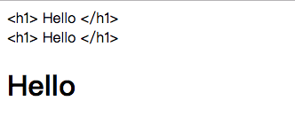
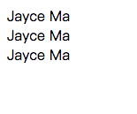
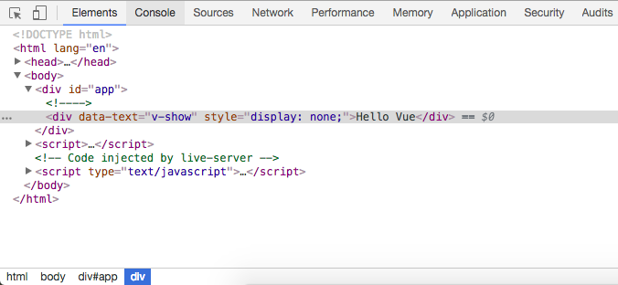
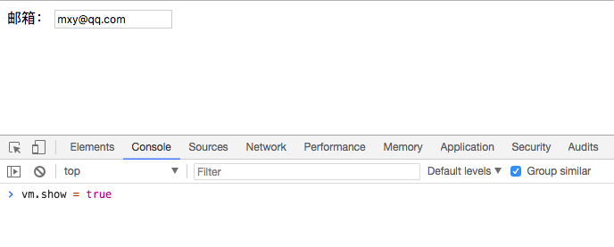
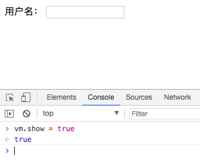
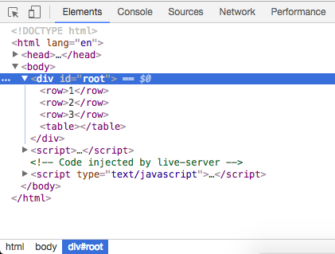
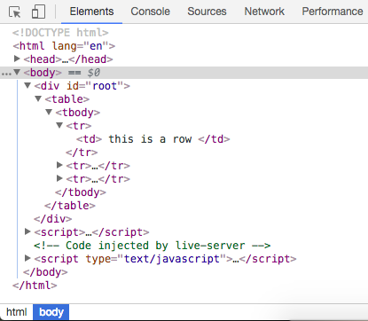

## 模版语法
三种简单的方式
```
html:
<div id="app">
    <div>{{ message }}</div>
    <div v-text= 'message'></div>
    <div v-html= 'message'></div>
</div>

JS:
var vm = new Vue({
    el: '#app',
    data:{
        message:'<h1> Hello </h1>'
    }
})
```

像上图中我们看到的，三者的区别在于，v-html可以保留html的语法，将Hello渲染成标题一的样式

值得注意的是，我们在这三种模版语法中不仅可以使用变量message，还可以写成JS表达式的形式
```
html:
<div id="app">
  <div>{{ name + ' Ma' }}</div>
  <div v-text="name + ' Ma'"></div>
  <div v-html="name + ' Ma'"></div>
</div>

JS:
<script>
  var vm = new Vue({
      el:'#app',
      data: {
          name: 'Jayce'
      }
  })
</script>
```

## 计算属性computed、方法methods和监听器watch
```
html:
<div id="app">
  {{ fullName }}
  {{ age }}
</div>

JS:
<script>
  var vm = new Vue({
      el:'#app',
      data: {
          firstName: 'Jayce',
          lastName: 'Ma',
          fullName: 'Jayce Ma',
          age: 22
      },
      //计算属性基于它的依赖进行缓存，只有在它的依赖发生改变时它才会重新求值
      computed: {
          fullName: function() {
              console.log("计算了一次");  //如果不更改firstName和lastName的值，这一条不会被控制台打印出来
              return this.firstName + " " + this.lastName
          }
      },
      //方法属性同样可以实现计算属性的功能，但不同的是，调用方法总是会在触发重新渲染时再次执行函数
      methods: {
          fullName: function(){
              console.log("计算了一次");  //这一条无论何时只要调用了方法就会被打印出来
              return this.firstName + " " + lastName
          }
      },
      //监听器的使用要敲这么多行代码，然而实现的功能却和上面是完全一致的
      watch: {
          firstName: function(){
              console.log("计算了一次");
              this.fullName = this.firstName + " " + this.lastName;
          },
          lastName: function(){
              console.log("计算了一次");
              this.fullName = this.firstName + " " + this.lastName;
          }
      }
  })
</script>
```
## 条件渲染
v-show 和 v-if 都能控制一个模版标签是否在页面上显示，区别在于 v-if 对应标签的变量名只要是false，它就不会存在在DOM之上，而 v-show 对应的标签变量名变为false，它仍然存在在标签上，只不过是以 display: none; 的形式存在。通常，如果需要频繁切换元素显示或隐藏就用 v-show ，不然就用 v-if
```
html:
<div id="app">
  <div v-if="show" data-text="v-if">{{ message }}</div>
  <div v-show="show" data-text="v-show">{{ message }}</div>
</div>

JS:
<script>
  var vm = new Vue({
      el: '#app',
      data: {
          show: false,  //为true的时候，两者都在页面中显示
          message: "Hello Vue"
      }
  })
</script>
```


还有一点v-if通常和v-else连用
```
html:
<div id="app">
  <div v-if="show">
    用户名：<input key="xxx"/>
  </div>
  <div v-else="show">
    邮箱：<input key="yyy"/>
  </div>
</div>

JS:
<script>
  var vm = new Vue({
      el:'#app',
      data: {
          show: false,
      }
  })
</script>
```
上面情况下刷新页面会先显示邮箱加一个输入框，当我们在输入框输入一些内容，然后在控制台输入 vm.show = true 时，页面切换成用户名并且输入框的内容会消失，这是因为给了输入框两个不同的key值，这样一个输入框就绑定了一个key值，在切换的过程中输入框的内容会随着前面提示信息的改变而变化

这时，按下回车键，切换成用户名并且输入框的内容消失

## Vue中的样式绑定
- 用class的对象绑定
```
html:
<style>
  .activated { color:pink; }
</style>

<div id="app">
  <div @click="handleDivClick"  :class="{activated: isActivated}">
    Hello style
  </div>
</div>

JS:
<script>
  var vm = new Vue({
      el: '#app',
      data: {
          isActivated: false
      },
      methods: {
          handleDivClick: function(){
              this.isActivated = !this.isActivated  //取反
          }
      }
  })
</script>
```
- 用class的数组绑定，数组内是变量名，可以添加多个
```
html:
<style>
  .activated { color:pink; }
</style>

<div id="app">
  <div @click="handleDivClick"  :class="[activated]">
    Hello style
  </div>
</div>

JS:
<script>
  var vm = new Vue({
      el: '#app',
      data: {
          activated: "",
          activedOne: ""
      },
      methods: {
          handleDivClick: function(){
              this.activated = this.activated === "activated" ? "" : "activated"
          }
      }
  })
</script>
```
- 用style的对象绑定
```
html:
<div id="app">
  <div @click="handleDivClick" :style="styleObj">  //style中还可以是数组的形式<div :style="[styleObj, {fontSize: '30px'}]"></div>
     Hello style
  </div>
</div>

JS:
<script>
  var vm = new Vue({
      el:'#app',
      data: {
          styleObj: {
              color: "black"
          }
      },
      methods: {
          handleDivClick: function(){
              this.styleObj.color = this.styleObj.color === "black" ? "red" : "black";
          }
      }
  })
</script>
```
## Vue实现一个todoList功能
```
html:
<div id="app">
  <input type="text" v-model="inputValue">
  <button v-on:click="handleBtnClick">提交</button>
  <ul>
    <li v-for="item in list">{{ item }}</li>
  </ul>
</div>

JS:
<script>
  var vm = new Vue({
      el: '#app',
      data: {
          list: [],
          inputValue: ''
      },
      methods: {
          handleBtnClick: function(){
              this.list.push(this.inputValue)
              this.inputValue = ''
          }
      }
  })
</script>
```
## 组件使用中的细节点
1. table标签中只能使用tr标签、ul标签中只能使用li标签、select标签中只能使用option标签，如果将他们里面的子标签换成组件，那么控制台可以看到小bug，tr不能被包裹在table标签中了，而是和table成了同级标签
```
html:
<div id="root">
  <table>
    <tbody>
      <row></row>
      <row></row>
      <row></row>
    </tbody>
  </table>
</div>

JS:
<script>
  Vue.component ('row', {
      template: '<tr><td> this is a row </td></tr>' 
  })

  var vm = new Vue({
      el: '#root'
  })
</script>
```

如何解决？修改html中的内容，在tr标签上加上is属性
```
html:
<div id="root">
  <table>
    <tbody>
      <tr is="row"></tr>
      <tr is="row"></tr>
      <tr is="row"></tr>
    </tbody>
  </table>
</div>
```

2. 在子组件定义data的时候，data必须是一个函数，return一个对象，在根实例（var vm = new Vue）中不需要，这样做的意义在于，让每一个子组件拥有一块独立的数据存储，不会出现组件间互相影响的现象
3. 使用ref实现求和功能
```
<div id="root">
  <counter ref="one" @change="handleChange"></counter>
  <counter ref="two" @change="handleChange"></counter>
  <div>{{ total }}</div>
</div>

JS:
<script>
Vue.component('counter', {
    template: '<div @click="handleClick">{{ number }}</div>',
    data: function() {
        return {
            number: 0
        }
    },
    methods: {
        handleClick: function() {
            this.number ++
            this.$emit('change')
        }
    }
})

var vm = new Vue({
    el: '#root',
    data: {
        total: 0
    },
    methods: {
        handleChange: function(){
            this.total = this.$refs.one.number + this.$refs.two.number
        }
    }
})
</script>
```
## 父子组件传值(以一个计数器为例)
- 父组件通过属性的形式向子组件传递数据（ 爸爸身上自带属性 v-bind:xxx, yyy ，儿子接收这些属性 props:['xxx','yyy'] ）
- 子组件通过事件向父组件发射数据（ 儿子身上向外发出事件 $emit('ddd'），爸爸监听事件 v-on:ddd= )
```
html:
<div id="root">
    <counter :count="2" @inc="handleIncrease"></counter>
    <counter :count="3" @inc="handleIncrease"></counter>
    <div>{{ total }}</div>
</div>

JS:
<script>
    var counter = {
        props: ['count'], //接收父组件中的数据
        data: function () {
            return {
                number: this.count //子组件不能随意更改父组件中的数据，只能通过克隆一个副本再在子组件内部进行修改，这里克隆了父组件中的count数据，子组件通过操作number就能更改父组件中的数据
            }
        },
        template: '<div @click="handleClick">{{ number }}</div>',
        methods: {
            handleClick: function () {
                this.number = this.number + 2;
                this.$emit('inc', 2)  //这里的第二个参数是每点击一次加多少值
            }
        }
    }

    var vm = new Vue({
            el: '#root',
            data: {
                total: 5
            },
            components: {
                counter: counter
            },
            methods: {
                handleIncrease: function (step) {  //这里的step是$emit里传过来的第二个参数
                    this.total += step
                }
            }
        }) 
</script> 
```
## 非父子组件传值（中央事件总线：eventBus）
需求是做一个点击事件，点击上面的元素，下面的元素切换成和上面一样，下面的元素点击切换成和上面的元素一样，即同级元素之间互相传值
```
html:
<div id="root">
  <child content="Jayce"></child>
  <child content="Ma"></child>
</div>

JS:
<script>
  Vue.prototype.bus = new Vue()  //关键句

  Vue.component('child', {
      props: {
          content: String
      },
      data: function(){
          return {
              selfContent: this.content  //这一句的目的在于克隆父组件的数据在子组件内使用，因为子组件不能修改父组件内的数据
          }
      },
      template: '<div @click="handleClick">{{ selfContent }}</div>',
      methods: {
          handleClick: function(){
              this.bus.$emit('change',this.selfContent)
          }
      },
      mounted: function(){
          var this_ = this
          this.bus.$on('change',function(msg){
              this_.selfContent = msg
          })
      }
  })

  var vm = new Vue({
      el: '#root'
  })
</script>
```
## 给组件绑定原生事件（在事件绑定后面加上.native的修饰符即可）
我们来看一下具体实现步骤
1. 
```
html:
<div id="root">
  <child @click="handleClick"></child>  //这种情况下点击Child并不会触发handleClick，也就不会弹出alert('click')中的内容，这是因为当我给一个组件绑定一个事件的时候，这个事件其实是一个自定义的事件，真正的鼠标点击并不是我绑定的这个click事件
</div>

JS:
<script>
  Vue.component('child', {
      template: '<div>Child</div>',
  })

  var vm = new Vue({
      el: '#root',
      methods: {
          handleClick: function(){
              alert('click')
          }
      }
  })
</script>
```
2. 想要触发这个自定义的绑定事件，应该在子组件里对div元素添加事件
```
html:
<div id="root">
  <child @click="handleClick"></child>
</div>

JS:
<script>
  Vue.component('child', {
      template: '<div @click="handleChildClick">Child</div>',  //从这里开始给div元素添加了事件
      method: {
          handleChildClick: function(){
              alert('child click')  //这个时候child click可以被提示出来，但click不行，因为在div元素上绑定的事件是原生的事件，而在外部child组件上绑定的事件是一个监听的自定义事件，子组件想要监听父组件的事件需要添加下面一行
              this.$emit('click')  //这样两个提示框里的内容都会被提示
          }
      }
  })

  var vm = new Vue({
      el: '#root',
      methods: {
          handleClick: function(){
              alert('click')
          }
      }
  })
</script>
```
这样做的原理是：当你触发了click事件，子组件会监听到自身的div元素被点击了，然后向外触发一个自定义事件（$emit)，然而你在外部运用的child组件中监听了这个自定义事件，进而这个handleClick就会被执行
3. 上面第二步的做法实在是太复杂，有时候我们的需求是就想在这个外部的child组件上监听一个原生事件，如果像上面这样经过两层传递太过麻烦
```
html:
<div id="root">
  <child @click.native="handleClick"></child>  //加上一个.native这样你监听到的就不是child组件向外传递的自定义事件，而是一个原生事件了
</div>

JS:
<script>
  Vue.component('child', {
      template: '<div>Child</div>',
  })

  var vm = new Vue({
      el: '#root',
      methods: {
          handleClick: function(){
              alert('click')
          }
      }
  })
</script>
```
## Vue中的插槽slot的使用（父组件如何优雅地向子组件传递它的DOM结构）
```
html:
<div id="root">
  <body-content>  //包裹在这个元素内部的都是插槽的内容
    <div class="header" slot="header">我是顶部栏</div>  //这是两个具名插槽，用 slot="xxx" 为这个插槽命名
    <div class="footer" slot="footer">我是底部栏</div>
  </body-content>
</div>

JS:
<script>
  Vue.component('body-content', {
      template: `<div>
                    <slot name='header'></slot>  //在这里使用插槽，用 name='xxx' 使用对应名字的插槽，如果上面定义的不是具名插槽，那么下面在用的时候会把插槽内的内容全部显示出来，所以如果想要在相应的位置显示相应的内容，那么建议使用具名插槽
                    <div class='content'>我是内容区</div>
                    <slot name='footer'></slot>
                </div>`
  })

  var vm = new Vue({
      el: '#root'
  })
</script>
```
## Vue中作用域插槽的使用