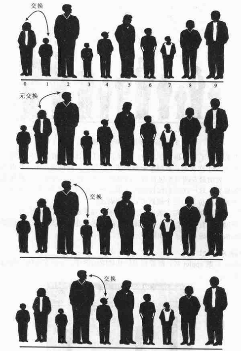
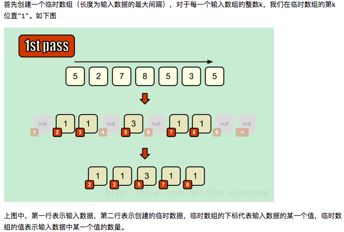
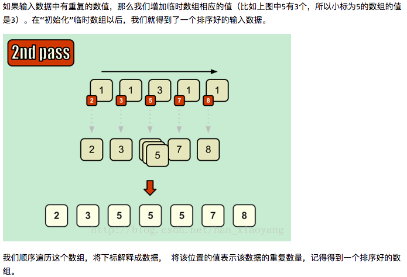
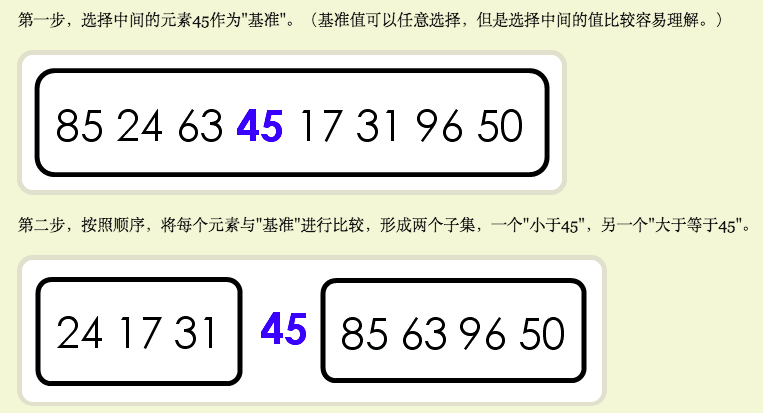
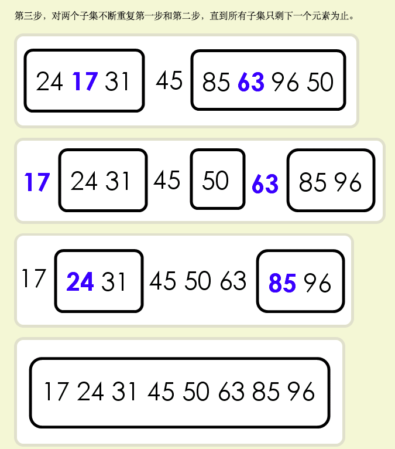
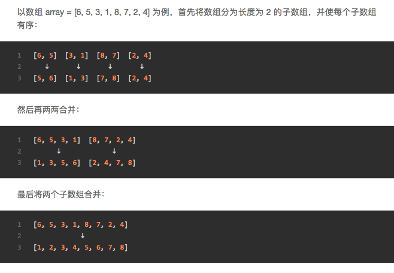
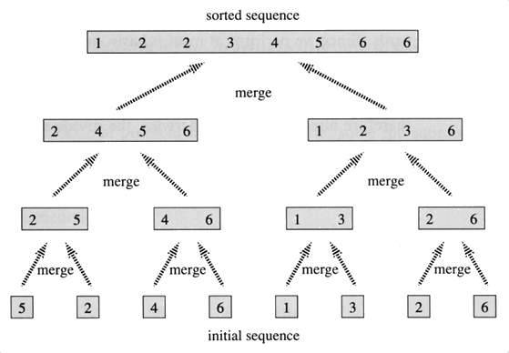

1. 冒泡排序BubbleSort
  - 比较相邻两个元素，如果第一个比第二个大，那么就交换两个的位置
  - 从第一个到n-1个数重复同样的工作，那么最大的那个数就被放在了最后一位
  - 一直到没有任何一对数字需要比较为止，那么这一组数字就被从小到大排列

2. 选择排序SelectionSort
  - 在一组数字中找到最小的那个数字放在排序的起始位置上
  - 再从剩下的数字中找到最小的元素和原数组中第二位置的数字交换
  - 以此类推，直到所有的元素都被排序
举例来说：一个数组 {13,15,37,89,60,39,12,109,56,72}

第一遍 ：12  {15,37,89,60,39,13,109,56,72}

第二遍：12 ，13 {37,89,60,39,15,109,56,72}

第三遍：12 ，13 ，15 {89,60,39,37,109,56,72}

……
直到所有的数被排列过一遍

3. 计数排序CountingSort
    - 在待排序的数组中找出最大的和最小的
    - 统计数组中每个值为i的元素出现的个数，存入数组A的第i项
    - 对所有的计数累加（从A中第一个元素开始，每一项和前一项相加）
    - 反向填充目标数组：将每个元素放在新数组的第i项

4. 快速排序
- 在一组待排序的数列中，选择一个数组作为基准
- 将剩下的数字全部和基准做比较，小于它的都放在左边，大于它的都放在右边
- 对于这个基准左右两侧的数组不断重复前面两步，直到这两侧的数组都只剩下一个元素为止

5. 插入排序InsertionSort
- 首先我们认为第一个元素是排好序的，从第二个元素开始遍历
- 将这第二个元素，在已经排好序的元素中从后往前找
- 如果序列中的元素比当前元素大，就将序列中的元素向后移
- 重复上面一条的步骤，直到已排序的元素小于等于新元素
- 将新元素插入到该位置后重复上述步骤

与我们打扑克时整理手上的牌非常类似：摸来的第1张牌无需整理，此后每次从桌上的牌(无序区)中摸最上面的1张并插入左手的牌(有序区)中正确的位置上。为了找到这个正确的位置，需自左向右(或自右向左)将摸来的牌与左手中已有的牌逐一比较。

6. 归并排序MergeSort
    - 将数组划分为两个或两个以上的子数组，每个数组中包含两个元素
    - 先对每个子数组中的元素进行排列
    - 再将两两数组排序后再归并

